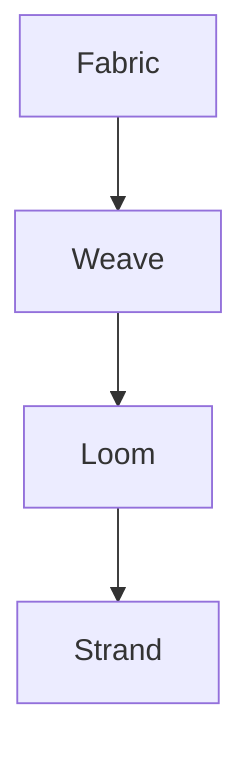
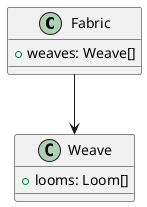

# Markdown Features Guide

Frame Codex supports **GitHub Flavored Markdown (GFM)** plus custom enhancements for knowledge management. This guide covers every feature available to you.

## Philosophy

> "Markdown is a lightweight markup language with plain-text formatting syntax designed so that it can be converted to HTML and many other formats."

In Frame Codex, markdown serves as the **universal language** for human-readable knowledge that machines can also parse, index, and synthesize.

## Text Formatting

### Basic Emphasis

```markdown
*italic* or _italic_
**bold** or __bold__
***bold italic*** or ___bold italic___
~~strikethrough~~
`inline code`
```

**Renders as:**

*italic* or _italic_  
**bold** or __bold__  
***bold italic*** or ___bold italic___  
~~strikethrough~~  
`inline code`

### Subscript and Superscript

```markdown
H~2~O  
E = mc^2^
```

H~2~O  
E = mc^2^

## Headings

```markdown
# Heading 1
## Heading 2
### Heading 3
#### Heading 4
##### Heading 5
###### Heading 6
```

**Best practices:**
- Use one `#` heading per strand (the title)
- Start hierarchy at `##` for sections
- Don't skip levels (e.g., `##` → `####`)
- Keep headings concise and descriptive

## Lists

### Unordered Lists

```markdown
- Item 1
- Item 2
  - Nested item 2.1
  - Nested item 2.2
- Item 3

* Also works
+ This too
```

- Item 1
- Item 2
  - Nested item 2.1
  - Nested item 2.2
- Item 3

### Ordered Lists

```markdown
1. First item
2. Second item
   1. Nested ordered
   2. Another nested
3. Third item
```

1. First item
2. Second item
   1. Nested ordered
   2. Another nested
3. Third item

### Task Lists

```markdown
- [x] Completed task
- [ ] Uncompleted task
- [ ] Another task
```

- [x] Completed task
- [ ] Uncompleted task
- [ ] Another task

## Links

### External Links

```markdown
[OpenAI](https://openai.com)
[Link with title](https://example.com "Example Site")
```

[OpenAI](https://openai.com)

### Internal Strand Links

```markdown
[Architecture Overview](/wiki/architecture/overview)
[Getting Started](./getting-started)
```

### Autolinks

```markdown
https://frame.dev automatically becomes a link
```

https://frame.dev

### Reference Links

```markdown
I love [Frame Codex][1] and [OpenStrand][2].

[1]: https://frame.dev
[2]: https://github.com/openstrand
```

## Images

### Single Image

```markdown


```

### Automatic Gallery (3+ Images)

When you add 3 or more images consecutively, Frame Codex automatically creates a **golden-framed Art Deco gallery**:

```markdown


```

Features:
- Golden ratio layout (φ ≈ 1.618)
- Art Deco corner ornaments
- Hover effects
- Responsive grid
- Theme-aware styling

### Image Sizing (HTML)

```markdown

```

## Code

### Inline Code

```markdown
Use `const` instead of `var` in JavaScript.
```

Use `const` instead of `var` in JavaScript.

### Code Blocks

````markdown
```javascript
function fibonacci(n) {
  if (n <= 1) return n
  return fibonacci(n - 1) + fibonacci(n - 2)
}
```
````

Supported languages include:
- `javascript` / `typescript` / `jsx` / `tsx`
- `python` / `rust` / `go` / `c` / `cpp` / `java`
- `bash` / `shell` / `powershell`
- `json` / `yaml` / `toml` / `xml`
- `markdown` / `html` / `css` / `scss`
- `sql` / `graphql`
- And many more!

### Code with Line Numbers

````markdown
```typescript {1,3-5}
const phi = (1 + Math.sqrt(5)) / 2  // highlighted
const fibonacci = (n: number): number => {
  if (n <= 1) return n  // highlighted
  return fibonacci(n - 1) + fibonacci(n - 2)  // highlighted
}
```
````

## Tables

```markdown
| Feature | Status | Priority |
|---------|--------|----------|
| Gallery | ✅ Done | High |
| Voice Recorder | ✅ Done | Medium |
| Q&A System | 🚧 In Progress | High |
| API | 📋 Planned | Low |
```

**Alignment:**

```markdown
| Left-aligned | Center-aligned | Right-aligned |
|:------------|:--------------:|--------------:|
| Text        | Text           | Text          |
```

| Left-aligned | Center-aligned | Right-aligned |
|:------------|:--------------:|--------------:|
| Text        | Text           | Text          |

## Blockquotes

```markdown
> "The best way to predict the future is to invent it."
> — Alan Kay

> Nested quotes:
>> "Knowledge is power."
>> — Francis Bacon
```

> "The best way to predict the future is to invent it."  
> — Alan Kay

## Horizontal Rules

```markdown
---
***
___
```

All three render as:

---

## HTML Support

Frame Codex supports raw HTML for advanced layouts:

```html
<div style="text-align: center; padding: 2rem; background: linear-gradient(135deg, #FFD700, #B8860B); border-radius: 0.5rem;">
  <h3>Art Deco Box</h3>
  <p>Custom styled content</p>
</div>
```

### Details/Summary (Collapsible)

```markdown
<details>
<summary>Click to expand</summary>

Hidden content goes here!

- Can contain markdown
- And lists
- And **formatting**

</details>
```

<details>
<summary>Click to expand</summary>

Hidden content goes here!

- Can contain markdown
- And lists
- And **formatting**

</details>

## Emojis

```markdown
:rocket: :art: :books: :sparkles: :fire:
```

🚀 🎨 📚 ✨ 🔥

Or use Unicode directly: ✨ 🌟 💫 ⭐

## Footnotes

```markdown
Here's a sentence with a footnote[^1].

[^1]: This is the footnote content.
```

## Mentions and Hashtags

```markdown
@username
#topic
```

These are parsed for semantic indexing but don't create hyperlinks (yet).

## Control Flags (Hidden from Render)

Add metadata flags at the top of your strand that won't appear in the rendered view:

```markdown
skip_ai: true # Exclude from AI analysis
skip_index: true # Don't include in search index
manual_tags: true # Don't auto-suggest tags
```

These are automatically stripped before rendering.

## Math Notation (Coming Soon)

```markdown
Inline: $E = mc^2$

Block:
$$
\phi = \frac{1 + \sqrt{5}}{2} \approx 1.618033988749895
$$
```

## Diagrams (Coming Soon)

### Mermaid

````markdown

````

### PlantUML

````markdown

````

## Frontmatter (YAML)

Add metadata at the **end** of your strand:

```markdown
---

metadata:
title: My Strand
tags: [knowledge, tutorial]
created: 2024-01-15
author: Your Name
status: draft
---
```

This data is indexed for search and displayed in the metadata panel.

## Best Practices

### ✅ Do

- Use semantic headings (`#`, `##`, `###`)
- Add alt text to all images
- Keep lines under 120 characters for readability
- Use code blocks with language specifiers
- Add frontmatter metadata for better discovery

### ❌ Don't

- Use HTML when markdown will suffice
- Skip heading levels
- Embed very large images (optimize first)
- Use generic alt text like "image1"
- Forget to save your drafts!

## Advanced: Recursive Strand Composition

Frame Codex supports **strand-in-strand** composition using catalog schemas:

```markdown

```

Where `catalog.json` defines a logical strand collection:

```json
{
  "type": "gallery",
  "strands": [
    "./photo1.jpg",
    "./photo2.jpg",
    "./photo3.jpg"
  ],
  "metadata": {
    "title": "Art Deco Buildings",
    "location": "New York"
  }
}
```

This allows AI to treat the **entire collection as a single traversable knowledge node**.

---

## See Also

- [Getting Started](/wiki/tutorials/getting-started)
- [Media Guide](/wiki/tutorials/media-guide)
- [Search Guide](/wiki/tutorials/search-guide)

---

metadata:
title: Markdown Features Guide
tags: [tutorial, markdown, syntax, reference]
level: intermediate
created: 2024-01-15
